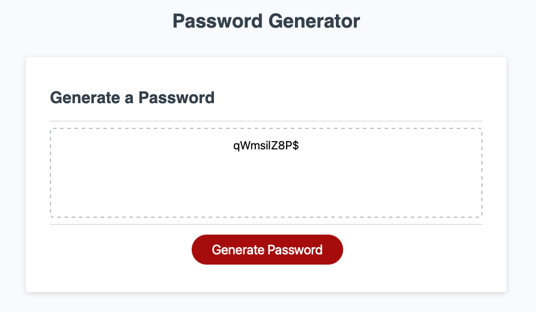

# Password Generator

## Description
This project was designed to help create a random passowrd. The user can choose 1 or more options. The options include lowercase letters, uppercase letters, numbers, and special characters. If the user chooses none of those options, the generator will loop until one is chosen. 

## Installation
To install the project, a starter code was provided. Once the JavaScript code was written, the project was published through GitHub.

## Usage
Help users create a random password.

## Credits
Starter code Provided by: https://github.com/coding-boot-camp/friendly-parakeet
Google: w3schools.com, stackoverflow.com, codeacedemy.com, and possibly more that I may have forgotten to note. 

## Website
https://sabrinarowan.github.io/password-generator/